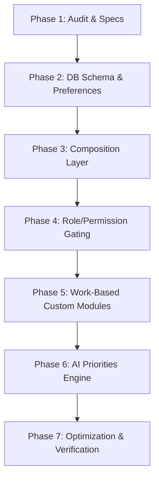

# 🏆 Personalized, Role-Aware Dashboard Architecture for OptivianAI

This document defines the architectural blueprint for transforming OptivianAI's current static dashboard into a personalized, role-aware, permission-gated, and AI-prioritized workspace.

---

## 1. Current Dashboard Architecture

The dashboard is implemented in [Dashboard.jsx](file:///c:/Users/Harshit%20Bhardwaj/Documents/Projects/OptivianAI/src/pages/Dashboard/Dashboard.jsx) and structured as follows:

*   **Data Fetching**: The dashboard executes a parallel fetching cycle during mounting and refreshing (`fetchData` method). It fetches all tasks in the organization, AI request analytics, and provider configurations.
*   **Static UI Mapping**: A frontend `dashboardConfig` mapping evaluates `user?.user_metadata?.role` to decide which sections are loaded on the client side:
    *   *Executives/Admins*: ExecutiveStats, AdvancedAnalytics, OrgOverview, StaffOverview, TaskCenter, CalendarWidget, NotificationCenter, AIDashboard, AIPanel, and QuickActions.
    *   *Staff*: ExecutiveStats, OrgOverview, TaskCenter, CalendarWidget, NotificationCenter, AIDashboard, and QuickActions (hides AdvancedAnalytics, StaffOverview, and AIPanel).
*   **Customization**: An unused `DynamicWidgetEngine.jsx` and an active `DashboardCustomizer.jsx` allow toggling and reordering widgets. However, they read and save configuration settings locally to a single browser key: `optivian_dashboard_widgets`.

---

## 2. Why the Dashboard is Identical for Users

Despite the basic role-based visibility toggles, the dashboard feels identical for users within the same organization due to several key factors:

1.  **Shared Raw Data**: The service `getTasks(user)` retrieves all tasks matching the user's `organization_id` from Supabase. Although `'staff'` roles undergo a JavaScript filter in `taskService.js` to only return assigned tasks, other roles (e.g., developers, designers, sales, marketing) do not have filtering applied and see all tasks of the organization.
2.  **Shared Organization Stats**: The `ExecutiveStats` component computes overall org completion rates, overdue rates, health score, and online status. These stats are displayed identically to all users in the organization (including regular staff, managers, and directors).
3.  **Local Customizer Shared Key**: The `DashboardCustomizer` saves its configuration under a single key (`optivian_dashboard_widgets`) in the browser's `localStorage`. If multiple users log in on the same machine/browser, they overwrite each other's custom dashboard layouts.
4.  **No Personalization Layer**: There is no personal greeting context, no user-specific workload priority, and no AI priority highlighting based on the user's specific workflow.

---

## 3. Existing User/Role/Permission Structure

OptivianAI has a highly detailed RBAC system defined in the codebase:

*   **22 Roles**: Ranging from Super Admin and Owner to support staff, interns, developers, clients, and read-only viewers (defined in [roles.js](file:///c:/Users/Harshit%20Bhardwaj/Documents/Projects/OptivianAI/src/services/auth/roles.js)).
*   **13 Resources & 5 Actions**: Access is governed by granular rules per resource (`view`, `create`, `edit`, `delete`, `manage`) defined in [permissions.js](file:///c:/Users/Harshit%20Bhardwaj/Documents/Projects/OptivianAI/src/services/auth/permissions.js).
*   **Database Check Constraint**: The `profiles` table in Supabase enforces a database check constraint (`profiles_role_check`) validating that the user's role is one of the 22 defined roles.

---

## 4. Existing Data Available for Personalization

The following data points are already available in the application to power personalization:

| Table / Source | Fields | Use for Personalization |
| :--- | :--- | :--- |
| **profiles** | `id`, `user_id`, `role`, `designation`, `organization_id`, `full_name` | Identifies user identity, department role, designation, and company membership. |
| **tasks** | `assigned_tos` (JSONB array), `assignee_statuses` (JSONB object), `assigned_by`, `due_date`, `priority` | Identifies tasks assigned to the user, tasks they created, tasks due soon, and overdue tasks. |
| **notifications** | `user_id`, `read`, `type`, `message`, `ref_type`, `ref_id` | Displays user-specific real-time alerts, task assignments, and mentions. |
| **ai_analyses** | `created_by`, `type`, `score`, `created_at` | Provides history of analyses executed by this specific user. |
| **login_history** | `user_id`, `ip_address`, `user_agent`, `created_at` | Details user login metrics. |
| **audit_log** | `actor_id`, `action`, `resource_type`, `created_at` | Tracks user activity across the organization. |

---

## 5. Required Database Changes

To persist user-specific dashboard layouts, custom widgets, and individual display preferences, we need to transition away from local storage.

### Option A: Preferences Column in `profiles` (Recommended)
Add a JSONB `preferences` column directly to the `profiles` table. This keeps the schema consolidated, avoids table joins, and speeds up profile fetches.

```sql
-- Migration to add preferences to profiles table
ALTER TABLE profiles ADD COLUMN IF NOT EXISTS preferences JSONB DEFAULT '{
  "dashboard_widgets": null,
  "theme": "light",
  "density": "comfortable"
}'::jsonb;
```

### Option B: Dedicated `user_preferences` Table
If dashboard settings or customization data expands significantly, a dedicated table is more appropriate.

```sql
CREATE TABLE IF NOT EXISTS user_preferences (
  id UUID DEFAULT gen_random_uuid() PRIMARY KEY,
  user_id UUID REFERENCES auth.users(id) ON DELETE CASCADE UNIQUE NOT NULL,
  profile_id UUID REFERENCES profiles(id) ON DELETE CASCADE UNIQUE NOT NULL,
  dashboard_layout JSONB DEFAULT '[]'::jsonb,
  theme TEXT DEFAULT 'light',
  density TEXT DEFAULT 'comfortable',
  created_at TIMESTAMPTZ DEFAULT now(),
  updated_at TIMESTAMPTZ DEFAULT now()
);

-- Enable RLS and add policies
ALTER TABLE user_preferences ENABLE ROW LEVEL SECURITY;

CREATE POLICY "user_prefs_select" ON user_preferences FOR SELECT USING (auth.uid() = user_id);
CREATE POLICY "user_prefs_insert" ON user_preferences FOR INSERT WITH CHECK (auth.uid() = user_id);
CREATE POLICY "user_prefs_update" ON user_preferences FOR UPDATE USING (auth.uid() = user_id);
```

---

## 6. Required Frontend Changes

To achieve the 5 levels of personalization, the frontend requires the following updates:

### A. Dashboard Composition Layer
Instead of hardcoding widgets in `Dashboard.jsx`, introduce a wrapper engine that maps dashboard widgets to modules and dynamically filters them based on roles and permissions.

```javascript
// Composition Model Mapping
const DASHBOARD_MODULES = [
  {
    id: 'executive-stats',
    component: ExecutiveStats,
    requiredPermission: { resource: 'dashboard', action: 'view' },
    allowedRoles: ['super_admin', 'owner', 'administrator', 'director', 'executive', 'manager'],
  },
  {
    id: 'advanced-analytics',
    component: AdvancedAnalytics,
    requiredPermission: { resource: 'analytics', action: 'view' },
    allowedRoles: ['super_admin', 'owner', 'administrator', 'director', 'executive'],
  },
  {
    id: 'my-tasks-summary',
    component: MyTasksSummary,
    requiredPermission: { resource: 'tasks', action: 'view' },
    allowedRoles: ['*'], // Visible to all roles
  },
  {
    id: 'staff-overview',
    component: StaffOverview,
    requiredPermission: { resource: 'users', action: 'view' },
    allowedRoles: ['super_admin', 'owner', 'administrator', 'hr', 'manager'],
  }
];
```

### B. Fetch Logic Refactoring
Refactor the fetching sequence in `Dashboard.jsx`:
1.  **Personal tasks vs. Organization tasks**: Staff, developers, sales, and marketing roles should only fetch tasks where their profile ID is in `assigned_tos`. Admins, owners, and managers fetch organization-wide tasks.
2.  **Activity logs**: Fetch the last 5 activities of the logged-in user to drive activity-based highlights.

### C. Personalization Levels Implementation
1.  **Level 1 (Role-Based)**: Adapt metrics in the stats widget based on the active role. A developer sees "Pull Requests" and "My Open Bugs" instead of "Staff Online" or "AI Costs".
2.  **Level 2 (Permission-Based)**: Wrap widgets in permission checks.
3.  **Level 3 (Work-Based)**: Prioritize "Tasks Assigned to Me", "Due Soon", and "Needs Review".
4.  **Level 4 (Activity-Based)**: Analyze audit/action logs to highlight the user's most frequently accessed tools.
5.  **Level 5 (AI-Prioritized)**: Feed the current user's profile and active tasks to the Gemini provider. The AI suggests a "Focus Area for Today" rather than a general organization report.

---

## 7. Security Implications

*   **Security at Database Level**: The frontend is only responsible for layout personalization. Row-Level Security (RLS) policies on Supabase must remain the sole authority. If a user is not authorized to read `audit_log` or `ai_analyses`, the API will return empty arrays, and the frontend will automatically hide those modules.
*   **Preventing Cross-User Overwrites**: Widget configuration must be saved with a user-specific scope. If storing in `localStorage` as a fallback, key it with the user ID: `optivian_dashboard_widgets_${userId}`.
*   **AI Access Scope**: The AI Advisor and autonomous manager services must construct prompts using *already filtered* client-side data (what the user is authorized to read). The AI must never perform raw table queries bypassing the user's RLS context.

---

## 8. Implementation Phases



### Phase 1: Audit & Specifications (Complete)
*   Inspect database, RBAC definitions, RLS, and dashboard components.
*   Draft `PERSONALIZED_DASHBOARD_ARCHITECTURE.md`.

### Phase 2: Database Schema & Preferences Persistence
*   Add preferences column to profiles database schema.
*   Create a profile preferences update endpoint in the frontend service layer.

### Phase 3: Dashboard Composition Layer
*   Define the `DASHBOARD_MODULES` config object.
*   Refactor `Dashboard.jsx` to render modules dynamically based on user permissions and user-customized order.

### Phase 4: Role and Permission Gating
*   Apply strict permission gating to each module before rendering.
*   Ensure RLS policies match frontend visibility checks.

### Phase 5: Work-Based Custom Modules
*   Create personal workload cards (e.g. `MyTasksSummary` with focus on personal deadlines, assignee statuses, and task workflows).

### Phase 6: AI Priorities Engine
*   Wire the Gemini model to analyze the user's active tasks and suggest a personalized "Daily Focus" or "Strategic Action".

### Phase 7: Optimization & Performance Verification
*   De-duplicate fetches, implement caching on task queries, and run the browser regression tests.
